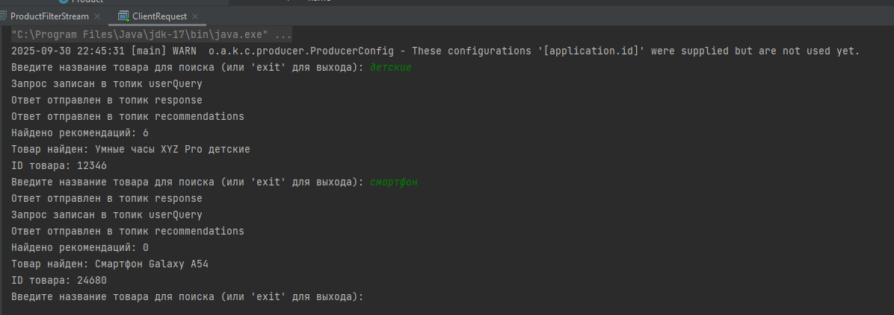
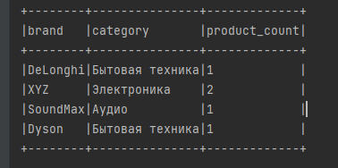
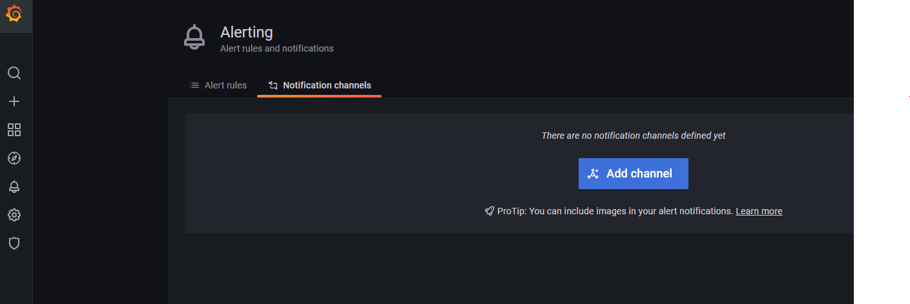
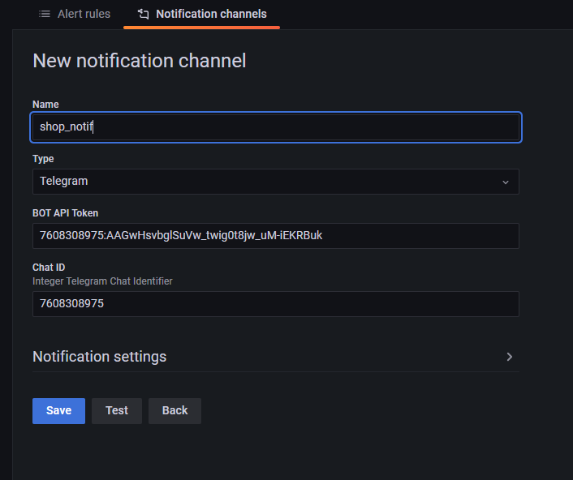
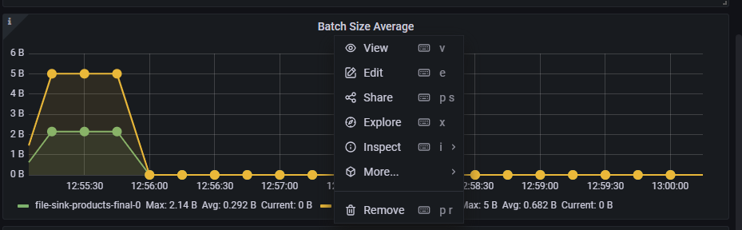
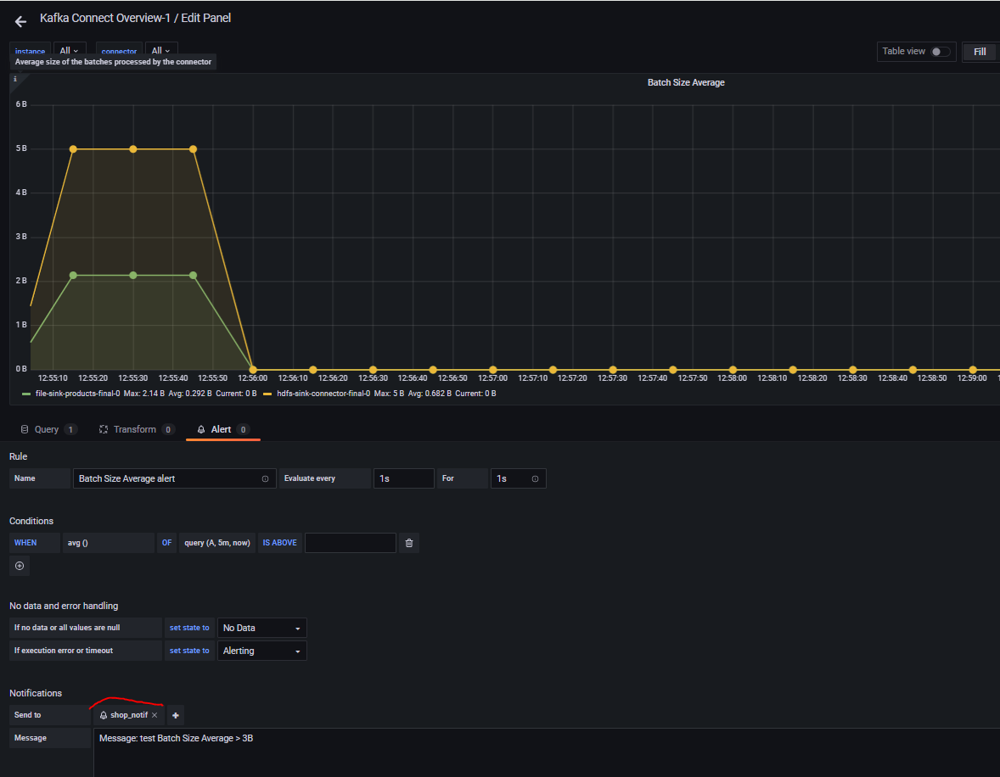
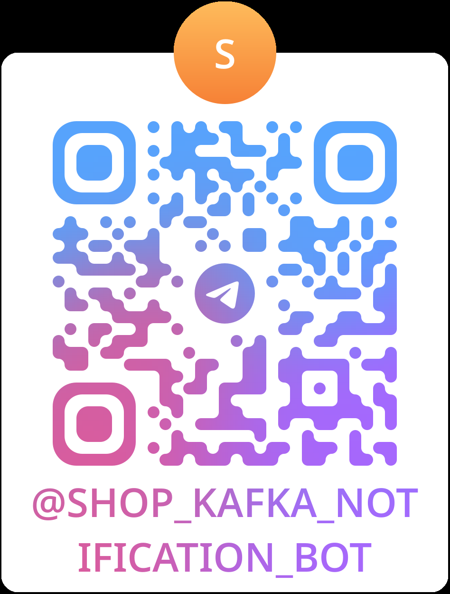
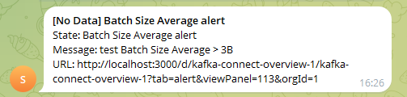

# Итоговый проект 
## Бизнес-контекст
«Покупай выгодно» — платформа электронной коммерции. Ближайшая цель маркетплейса — улучшить клиентский опыт и оптимизировать бизнес-процессы. Для этого команда хочет внедрить аналитическую платформу, которая будет собирать данные о взаимодействии клиентов с сайтом: просмотры товаров, добавление в корзину, покупки и отзывы. Полученную информацию будут обрабатывать алгоритмы машинного обучения — они выявят паттерны поведения и предпочтений клиентов.
В результате компания сможет показывать пользователям более релевантную рекламу, а также улучшить ассортимент товаров и качество обслуживания. Всё это повысит уровень удовлетворённости клиентов, увеличит конверсию и, как следствие, улучшит финансовые показатели компании.
###Архитектура системы
Тимлид и архитектор проекта продумали архитектуру системы.
Источники данных для системы — SHOP API и CLIENT API. SHOP API позволяет магазинам отправлять данные о товарах, CLIENT API предоставляет пользователям сервиса возможность выполнять запросы.
Связывать все сервисы платформы и обеспечивать надёжную передачу данных будет Apache Kafka. Данные от магазинов (SHOP API) будут попадать в кластер Kafka. Для безопасной передачи данных кластер планируется настроить с использованием TLS. Данные записываются в топики, которые должны быть закрыты для записи другим клиентам.
Для повышения надёжности и отказоустойчивости системы планируется реализовать репликацию данных, а также дублировать данные на второй кластер.
Аналитическая система будет перекладывать данные из второго кластера Kafka в Data Lake, реализованный на базе HDFS (Hadoop Distributed File System). На основе этого Data Lake тимлид и архитектор предлагают развернуть платформу Apache Spark, которая будет выполнять аналитические вычисления.
Обработчик в реальном времени должен проверять данные от магазинов и пропускать только разрешённые товары. Товары из списка запрещённых нужно фильтровать, обрабатывать их не надо. Обработчик будет подключён к основному кластеру Apache Kafka.
Для обеспечения надёжности и отслеживания производительности кластера Kafka нужно реализовать мониторинг; планируется интеграция с Prometheus и Grafana.
Для тестирования и отладки функций сервисов нужно организовать хранилище данных.
###Архитектура представлена на схеме ниже.
Серым отмечены необязательные элементы. Цветовая раскраска соответствует модулям курса.  


## Сборка проекта
 ```powershell
#запустите скрипт на выполнение или все команды из него
.\deploy.ps1
 ```
## 📊 Мониторинг
```
- **Kafka UI**: [http://localhost:8080](http://localhost:8080)
- **Kafka UI Destination**: [http://localhost:8082](http://localhost:8082) 
```
#Hadoop
## 📊 Мониторинг
```
- **HDFS UI**: [http://localhost:9870](http://localhost:9870)
- **Spark UI**: [http://localhost:8081](http://localhost:8085)
```
#SPARK
##Дополнительная настройка (единожды, если требуется)
Добавьте в файл C:\Windows\System32\drivers\etc\hosts:
text
127.0.0.1 hadoop-datanode-1
127.0.0.1 hadoop-datanode-2  
127.0.0.1 hadoop-datanode-3

Через командную строку
cmd
```
notepad C:\Windows\System32\drivers\etc\hosts
```
## 📊 Мониторинг
```
- **Spark UI**: [http://localhost:8081](http://localhost:8085)
```
#SHOP API
## Добавление заблокированного товара
1. Добавьте в файл blocked_products.txt код товара, который должен быть заблокирован **(файл предварительно заполнен для теста)**
2. Запустите на выполнение класс **shop/BlockedProductsProducer**
Пример:
```
   Successfully sent blocked product: 12345
   Successfully sent blocked product: 11223
   All blocked products from file sent to Kafka topic: blockedProducts
```
4. В топике blockedProducts появится информация о заблокированных товарах
## Загрузка товара в базу
1. Дополните файл products.json тестовыми данными **(файл предварительно заполнен для теста)**
2. Запустите на выполнение класс **shop/ProductFilterStream**
Пример:
```
   Product blocked: 12345
   Product allowed: 12346
   Product allowed: 12347
   Product allowed: 67890
   Product allowed: 24680
   Product allowed: 13579
   Product blocked: 11223
   Product allowed: 44556
```
4. В топике inputJsonStream появится вся информация из файла
5. В топике products появится информация обо всех товарах кроме заблокированных

**Подождите пару минут, для того чтобы данные успели попасть в реплику и далее в hadoop**

#CLIENT API
Пример простой аналитики:
1. поиск информации о товаре по его имени,
2. получение персонализированных рекомендаций.
##Запрос клиента:
1. Запустите на выполнение класс **client/ClientRequest**
2. Введите наименование товара, например: Умные часы XYZ Pro детские
3. Система найдет товар в аналоге БД (файле), запишет сам запрос и ответ в топики (userQuery, response), 
а так же выведет рекомендации по соответствующему бренду и категории и запишет в топик recommendations.
пример:

#Аналитика Spark
Пример простой аналитики:
1. Отчет о количестве товаров по бренду и категории
##Запрос аналитики:
**Важно! Работает на java 11 версии Amazon Corretto**
2. Запустите на выполнение класс **spark/SparkReadMain**
3. Результат анализа можно увидеть в топике **dataAnalysis** во втором кластере

# Prometheus
##Проверить метрики
1. Перейдите в Prometheus. Для этого в браузере введите ссылку http://localhost:9090
2. Нажав на вкладку “Status”, выберите поле “Targets”. В окне вы должны увидеть 2 сервиса
prometheus и kafka-connect-host. У каждого статус = up, результат для prometheus:


http://localhost:9876/metrics
# Grafana
1. Для просмотра метрик запустите Grafana (login/pass admin/admin) **http://localhost:3000**
##Dashboards
1.Импортируйте файл с настройками **./KafkaDebezium/grafana/dashboards/connect.json**
##Alerting
### настройка
1. Нажмите на колокольчик, далее на кнопку **Add channel**

2. Заполните поля, сохраните

3.на дашборде нажмите Edit

3. Alert/Create Alert, укажите требуемые параметры, для теста установлен минимум

###Telegramm канал
@Shop_Kafka_Notification_bot
Use this token to access the HTTP API:
7608308975:AAGwHsvbglSuVw_twig0t8jw_uM-iEKRBuk

###Пример сообщения в канале

